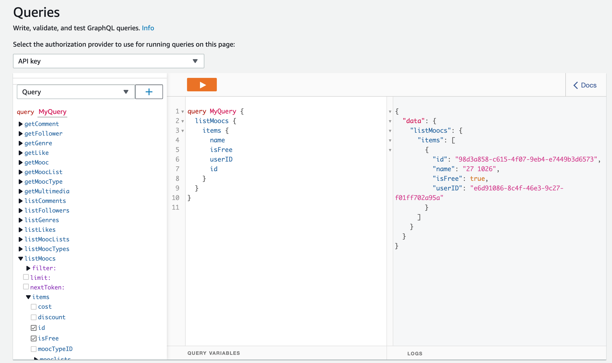
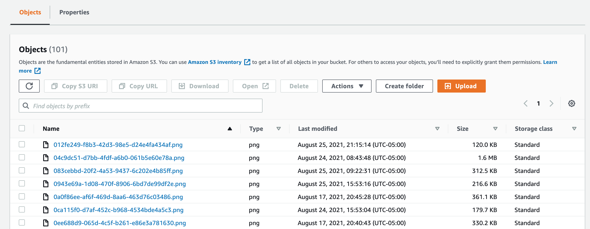
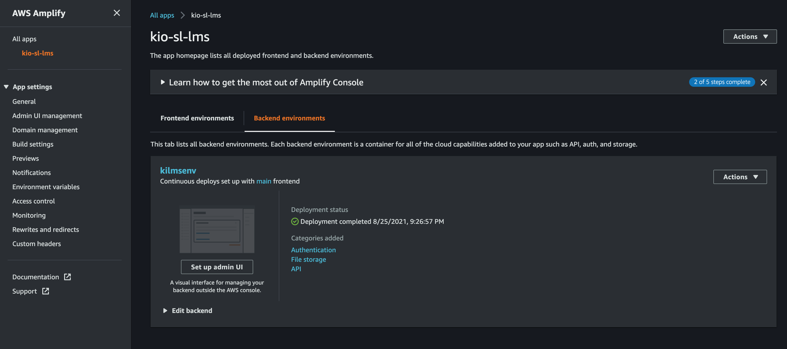
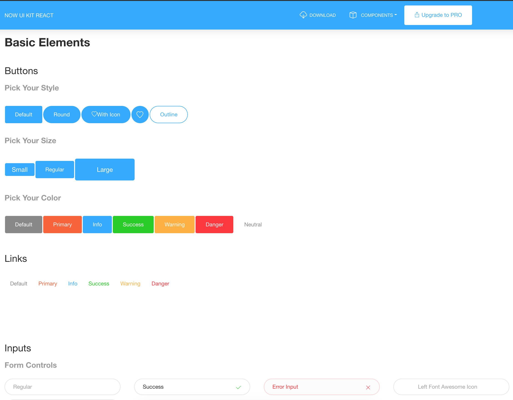
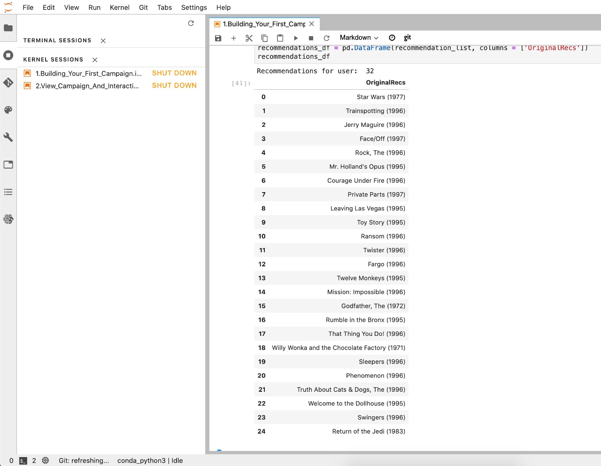
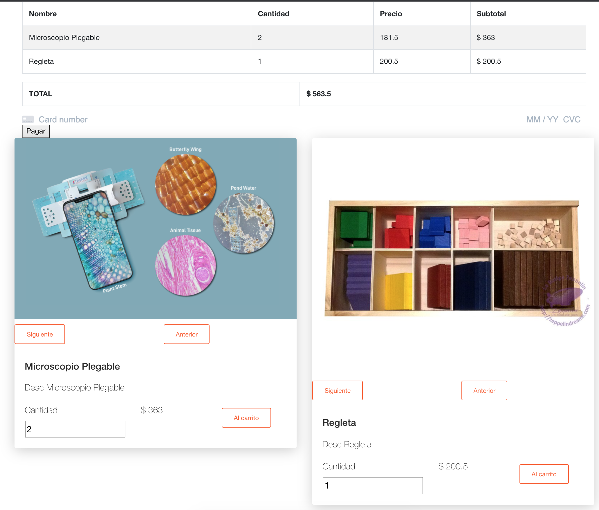
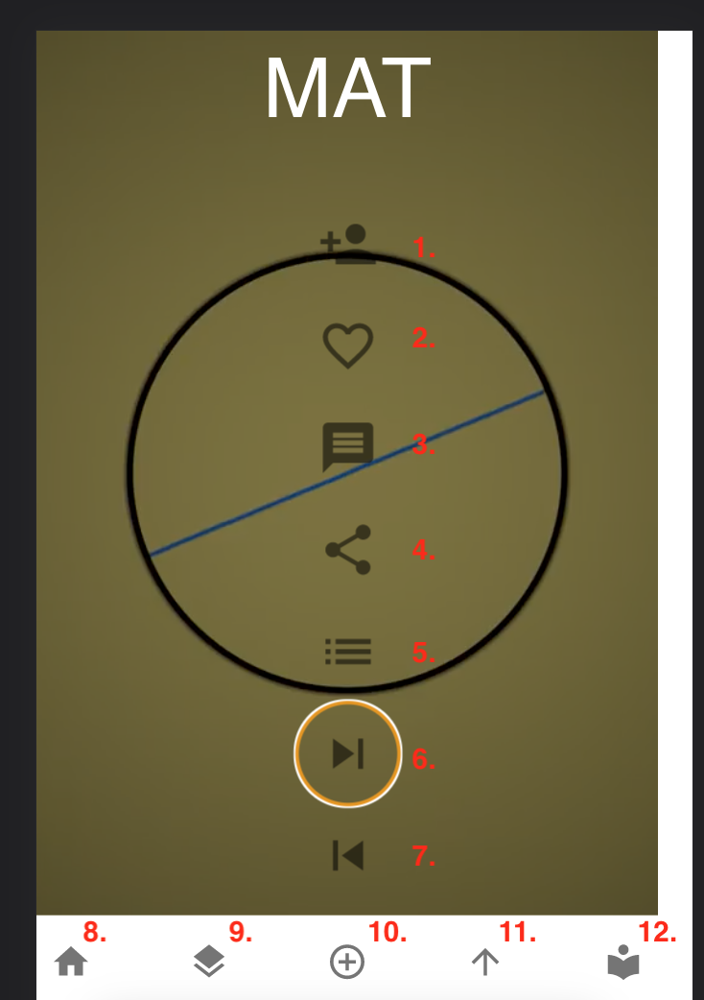
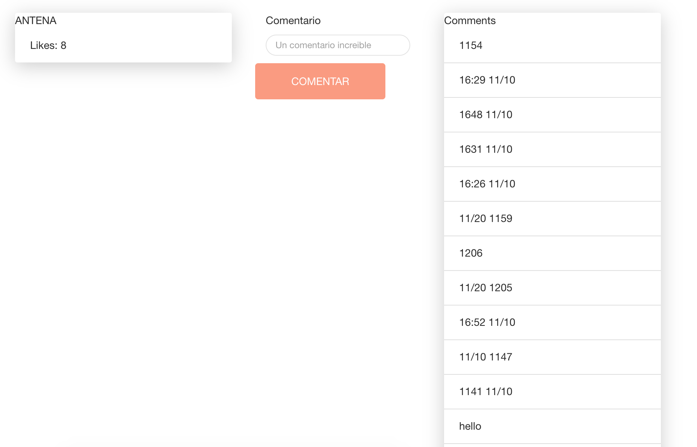

# Diseño de la Base de Datos

1. **User** 
- Contiene la información del usuario con su respectivo [Role] (Administrador, Publicador/Visualizador)

2. **Like** 
- El sentimiento que genera por el contenido multimedia

3. **Follow** 
- Los usuarios que sigue para ver su contenido

4. **Multimedia**
- Permite almacenar todo tipo de archivos multimedia (videos, imágenes, documentos), adicionalmente es el centro de la información de las relaciones

5. **Genre**
- Contiene las categorías de los archivos por ejemplo: ARTE, MATEMATICAS, FISICA, TRIGONOMETRIA, etc.

6. **MoocList** (History Board)
- Contiene el orden jerárquico de la historias apoyado en la estructura de datos (arbol eneario)

7. Mooc (Massive open online course)
- Curso online masivo que agrupa un curso

8. MoocType
- Clasificación de los MOOCs en: PodCast, Colaborativos, ebook, Webinar, Mixto

# API (AWS - AppSync - GraphQL)

> Haciendo uso del diseño de la base de datos se genero el API (Application Programming Interface) para cada una de las entidades del modelo, soportado con GraphQL para la manipulación, consulta y escucha de cambios en la BD

## Queries (Consultas)
> Permite obtener una entidad por su ID o listar filtrando por los IDs

## Mutation (CRUD)
> Permite Crear (Create), Leer (Read), Actualizar (Update) y Borrar (Delete) las entidades por ID (Identificador único)

## Subscriptions (Cambios)
> Permite escuchar los cambios que ocurren en las entidades en tiempo real, para los llamados de Crear, Actualizar y Borrar

# Autenticación y Autorización
> La autenticación esta apalancada por AWS Cognito para el registro e inicio de sesión de los usuarios de la plataforma según su autorización (rol)

# Almacenamiento
> El contenido multimedia se almacena en (Amazon S3 or Amazon Simple Storage Service) bajo las siguientes condiciones:
- Cada archivo tiene un identificador único para su identificación, ésto también permite compartirlo con ése ID
- Todos los archivos son privados
- Para prevenir la visualización o descarga de contenido privilegiado, los URLs se firman (Signed URL) con el fin de que el usuario en sesión pueda verlos o descargarlos si esa opción esta habilitada.

# Publicación
> Para la actualización del proyecto de nuevas funcionalidades se implemento la metodología CI/CD (Continuos Integration / Continuous Delivery) (Integración Continua y despliegue) que cuenta con las siguientes integraciones:
- AWS Code Commit: repositorio para el control de versiones, que cuenta con dos ramas **master** (producción) y **development** (desarrollo), donde cada vez que se hace un commit se despliega automaticamente el código
- Se genero su respectivo certificaco de seguridad para conexiones seguras
- Route 53: Se conectó el dominio de GoDaddy [wooow.digital](https://www.wooow.digital/)
- Entorno de desarrollo desplegado: [Desarrollo](https://development.d1q9t7bgr5y2mv.amplifyapp.com/)

# UI/Ux (Interfaces y Experiencia de Usuario)

> Las interfaces de usuario están construidas sobre la base de plantillas [Creative Tim](https://www.creative-tim.com/) especificamente NOW UI KIT, adicionalmente se integraron los frameworks: [React Bootstrap](https://react-bootstrap.github.io/) y  [Material UI](https://material-ui.com/components/links/)

## Intefaces de Usuario UI
>> Los enlaces de los componentes de las interfaces/administración/página de inicio se encuentran en la parte inferior del reproductor de videos

### UI Admnistrador

### Reproductor Multimedia (Video: https://youtu.be/TmjE0nD64Jo)
[Reproductor Multimedia](https://youtu.be/TmjE0nD64Jo)

### NOW UI KIT React

### CRUD MOOC (Video: https://youtu.be/iDhXS0cwRa8)
[Ejemplo creación MOOC](https://youtu.be/iDhXS0cwRa8)

msas2017

# Algoritmo para la Sugerencia de Videos

## Requerimientos

> Los requisitos mínimos de datos para entrenar un modelo son los siguientes:

>> 1000 registros de datos de interacción combinados (después de filtrar por eventType y eventValueThreshold, si se proporciona).

>> 25 usuarios únicos con al menos 2 interacciones cada uno.

## Actividad histórica de los usuarios
- Contenido multimedia consumido
- Sentimiento generado por el contenido multimedia consumido
- Categorías favoritas
- El contenido multimedia fué consumido completamente?
- Tiempo contenido multimedia que fué consumido
  
## Datos de los usuario
- Edad
- Genero
- Region
- Escolaridad

## Data
### Actividad de los usarios (Eventos) METADATA
- Clicks
- Que compran
- Que ven
- Conversiones
- 
### Detalles acerca de los artículos (Es opcional) METADATA
- Precio
- Categoria
- Estilo
- Genero
- Informacion ya contenida en el catalogo

### Detalles acerca de los usuarios METADATA
- Demografía
- Ubicación
- Edad
- Genero
- Nivel de suscripción

## Proceso

Inspeccionar los datos => Identificar funcionalidades => Seleccionar los parametros => Entrenar los modelos => Optimizar Modelos => Hospedar los modelos => Funcionalidades en tiempo real => API PERSONALIZADA

## Casos de usos

**Recomendaciones especificas a un usuario**
> Cuales recomendaciones son mas relevantes para un usuario en particular. 
> Algoritmo: Personalización de Usuarios

**Inicio frio de un usuario**
> Es un subconjunto de recomendaciones para un usuario que es desconocido, donde se muestra al usuario que resultados son realmente populares.
> Algoritmo: Personalización de Usuarios

**Inicio frio de un articulo**
> Similar a "Inicio frio de un usuario" pero aplicado a un nuevo articulo, la pregunta es: cómo promocionar un nuevo artículo? Se usan parametros de exploración para ver el comportamiento de los nuevos usuarios con un poco de nuevo contenido y hacer decisiones informadas rapitamente, de donde deben ser colocadas y mostradas.
> Algoritmo: Personalización de Usuarios

**Videos similares (SIMILARES)**
> No son los metadatos de una cosas similar a otra, pero que involucrar a los clientes con el contenido en formas similares. En el escenario de ventas al por menor: donde un cliente hace clic en un articulo y luego muestra articulos similares que otros clientes frecuentemente compran juntos.
> Algoritmo: SIMILARES

**Ranking personalizado**
> Tomamos una colección de artículos ya has curado de alguna manera, que puede ser potencialmente un filtro o puede ser un catálogo de artículos que quisiera promover, luego Personalize ayudará a posicionar con el fin de determinar cual tiene mayor probabilidad de ser de interes a tu usuario. Esto llevará a incrementar las conversiones o el compromiso de alguna forma.
> Algoritmo: Ranking-Personalizado

**Popularidad**
> Aquí es mirar cuales son los artículos mas populares basado en el comportamiento del usuario. Se considera una linea base midiendo el rendimiento con Personalize, mas allá de la popularidad en términos de resultados.
> Algoritmo: Popularity-Count

## Caracteristicas del Conjunto de Datos (Datasets)
- una colección grande de usuarios conocidos
- historia de su comportamiento y su comportamiento (al menos 10 interacciones por usuario)
- datos inmutables
- 50 o mas articulos

## Data de interacción
Es informacion del monitoreo de las acciones de los usuarios o clientes dentro de la plataforma (compras, compartir, likes, inclusive navegar) todo determinado por marca de tiempo (timestamp)

## Cuales datos son útiles (User metadata)?
Que queremos filtrar y cómo? Para el contenido multimedia por ejemplo es relevante al genero ya que es un atributo con el que podemos filtrar constantemente y tener mejores recomendaciones.

# Solución y Versión de la Solución
1. Solución: hace referencia a la combinación de una al Algoritmo y parametros personalizados
2. Versión de una Solución: hacer referencia al modelo entrenado por machine-learning que puede ser desplegado para optener recomendaciones para los clientes. Se puede acceder a través de un API

# Campañas

Una campaña es una versión de solución alojada; un punto final que puede consultar para obtener recomendaciones.

# IMPLEMENTACIÓN

## Herramientas

- Instancia AWS EC2 
- Despliegue/Limpieza de los recursos necesarios para entrenar los modelos (AWS Cloud Formation)
- [Jupyter](https://jupyter.org/try) Notebook
- [Datos de para correr los modelos: MovieLens](https://grouplens.org/datasets/movielens/)
  
## Dataset para las interacciones

### Schema
Al principio solo vamos a entrenar el modelo con:
 - USER_ID: identificador del usuario 
 - ITEM_ID (MULTIMEDIA_ID): identificador de la archivo multimedia
 - RATING: calificación de la pelicula de 1 a 5
 - EVENT_TYPE: click o visto  
 - TIMESTAMP: momento en el tiempo que fué consumido multimedia

Nombre de archivo: interaction.csv

**Al menos debemos tener 2500 interacciones para crear en motor de recomendaciones**

- Solo vamos a tener calificaciones positivas o vistas completas, asumiendo que mayor o igual a 3 cumple con éste filtro

## Metadata de los archivos multimedia
Cómo los usuarios 

### Dataset
- multimediaID: 
- título: Del título **no se aprende** ya que los hay palabras repetidas por consiguiente no lo vamos a tener en cuenta
- genre: Categoría

### Schema
ITEM_ID(movieId): identificador de la pelicula, relacionado con la pelicula
GENRE: o categorías (Ej. matematicas|fisica|computacion|arte) datos separado por "|"

Nombre de archivo: item-meta.csv

## Metadata de los usuarios

### Dataset
identificador
edad: Edad en años del usuario
genero: Genero del usuario
ubicación: Ciudad del usuario

### Schema
- USER_ID(identificador)
- AGE (edad)
- GENRE (genero)
- LOCATION (ubicación)

Nombre de archivo: user-meta.csv

# Entrenamiento
... ver Casos de Uso, Soluciones, Recetas

# Inferencias
Es un termino de machine-learning; para preguntar al modelo que haga un predicción (obtener recomendaciones)

##  Recomendaciones en tiempo real (RT)
- Experiencias interactivas para los usuarios (browser, mobile)
- GetRecommendations
- GerPersonalizedRanking
- Llamados sincronicos
- Baja latencia
- Auto escalamiento
- Requiere una campaña
- Soporta contexto
- Soporta filtros

# Tienda Virtual
## Funcionalidades
- Enlace [Mostrar productos: https://www.wooow.digital/display_products/](https://www.wooow.digital/display_products/)
- La tienda permite visualizar los productos disponibles en el inventario
- Ver la imágenes de los productos
- Agregar al carrito de compra
- Cálculo de totales de la compra según se agregan productos
- Integración con sistema de pago Stripe con tarjeta de credito

# Interfaz principal para la reproducción de Videos

## Funcionalidades de UI
1. Seguir a un publicador: permite seguir a un publicador de videos
2. Me gusta: lleva el conteo de "me gusta" y guarda quien le hizo "me gusta" a otro
3. Comentarios: permite hacer y ver los comentarios sobre el video que se esta reproduciendo 
4. Compartir: permite generar el enlace, copiar: para compartir a otras personas
5. Config
6. Video siguiente
7. Video anterior
8. Inicio: recarga los videos con mas me gusta
9. Filtro por categoria/tema: permite filtrar los videos por una categoría
10. Redirecciona para subir videos individualmente o crear un curso
11. Carga los videos por el mayor número de reproducciones (tendencia)
12. Perfil: permite actualizar el perfil del usuario 

## Funcionalidadess Internas
1. Si hay un video en el query string ejemplo: https://www.wooow.digital/hook_material_design/watch?v=aaaa-bbbb-cccc-dddd lo carga y lo pone como numero uno a reproducir
2. Organiza los videos según el número de me gusta de mayor a menor

## Funcionalidad Estado del Video

1. Permite ver el número de me gusta del video actual
2. Permite ver los comentarios hechos sobre el video actual

